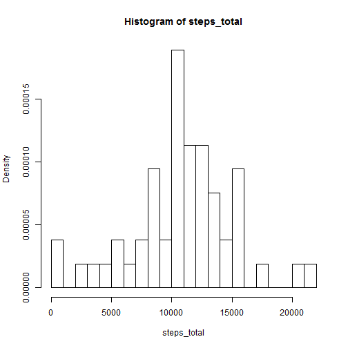
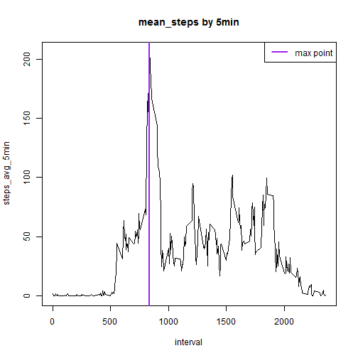
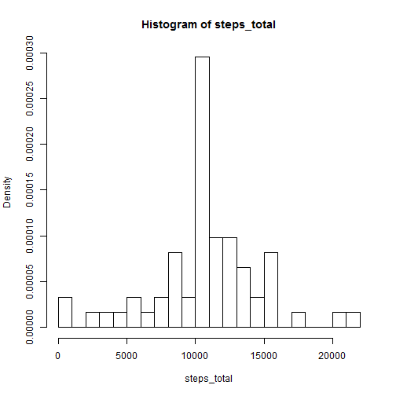
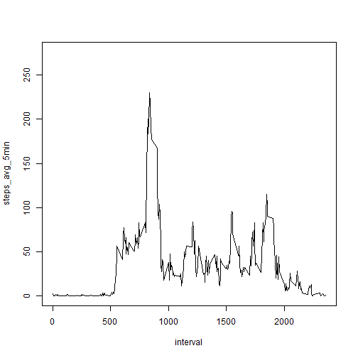
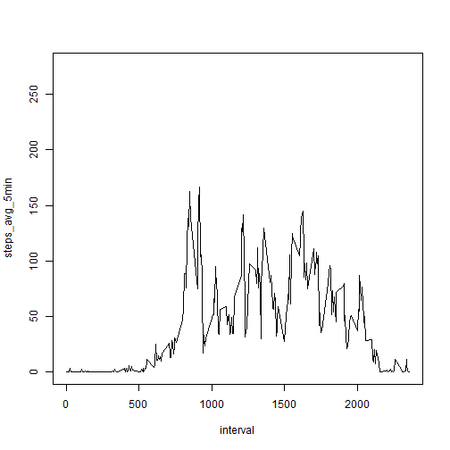

Reproducible research class - week 2 project
============================================


# Loading and preprocessing the data

## Show any code that is needed to:

* Load the data (i.e. read.csv())
* Process/transform the data (if necessary) into a format suitable for your analysis


```r
library(knitr)
opts_chunk$set(warning = FALSE)

library(dplyr)

setwd("C:\\_Zdata\\MachineLearning\\reproducibleresearch\\week2")
par(mfrow=c(2,3))
df_act0         <- read.csv("activity.csv", header = TRUE, sep = ",", quote = "\"")
#
df_act          <- df_act0[ !is.na(df_act0$steps), ]
df_act          <- df_act[ order(df_act$date), ]
```


## What is mean total number of steps taken per day?

Calculate the total number of steps taken per day
Make a histogram of the total number of steps taken each day
Calculate and report the mean and median of the total number of steps taken per day

```r
dfact1          <- setNames( aggregate( df_act$steps, by=list(date=df_act$date), FUN=sum)
                             , c("date", "steps_total"))
with( dfact1, hist(steps_total, breaks = ceiling(max(steps_total/1000)), freq=FALSE))
```



```r
dfact2          <- setNames( aggregate( df_act$steps, by=list(date=df_act$date), FUN=mean)
                             , c("date", "steps_mean"))
dfact3          <- setNames( aggregate( df_act$steps, by=list(date=df_act$date), FUN=median)
                             , c("date", "steps_median"))
dfall           <- bind_cols(dfact1, data.frame(steps_mean=dfact2$steps_mean)
                             ,  data.frame(steps_median=dfact3$steps_median))
dfall[,c("steps_mean", "steps_median")]
```

```
##    steps_mean steps_median
## 1   0.4375000            0
## 2  39.4166667            0
## 3  42.0694444            0
## 4  46.1597222            0
## 5  53.5416667            0
## 6  38.2465278            0
## 7  44.4826389            0
## 8  34.3750000            0
## 9  35.7777778            0
## 10 60.3541667            0
## 11 43.1458333            0
## 12 52.4236111            0
## 13 35.2048611            0
## 14 52.3750000            0
## 15 46.7083333            0
## 16 34.9166667            0
## 17 41.0729167            0
## 18 36.0937500            0
## 19 30.6284722            0
## 20 46.7361111            0
## 21 30.9652778            0
## 22 29.0104167            0
## 23  8.6527778            0
## 24 23.5347222            0
## 25 35.1354167            0
## 26 39.7847222            0
## 27 17.4236111            0
## 28 34.0937500            0
## 29 53.5208333            0
## 30 36.8055556            0
## 31 36.7048611            0
## 32 36.2465278            0
## 33 28.9375000            0
## 34 44.7326389            0
## 35 11.1770833            0
## 36 43.7777778            0
## 37 37.3784722            0
## 38 25.4722222            0
## 39  0.1423611            0
## 40 18.8923611            0
## 41 49.7881944            0
## 42 52.4652778            0
## 43 30.6979167            0
## 44 15.5277778            0
## 45 44.3993056            0
## 46 70.9270833            0
## 47 73.5902778            0
## 48 50.2708333            0
## 49 41.0902778            0
## 50 38.7569444            0
## 51 47.3819444            0
## 52 35.3576389            0
## 53 24.4687500            0
```


## What is the average daily activity pattern?

Make a time series plot (i.e. type = "l") of the 5-minute interval (x-axis) and the 
average number of steps taken, averaged across all days (y-axis)
Which 5-minute interval, on average across all the days in the dataset, contains the maximum number of steps?

```r
dfactx          <- setNames( aggregate( df_act$steps, by=list(date=df_act$interval), FUN=mean)
                             , c("interval", "steps_avg_5min"))
with(dfactx, plot(interval, steps_avg_5min, main="mean_steps by 5min", type="l") )
maxpoint        <- dfactx$interval[dfactx$steps_avg_5min==max(dfactx$steps_avg_5min)] 
ps              <- paste0("max number of steps is in ", toString(maxpoint), "th interval")
cat(ps)
```

```
## max number of steps is in 835th interval
```

```r
abline(v=maxpoint, col="purple", lwd=2)
legend("topright", 400, c("max point"), col=c("purple"), lty=c(1,1), lwd=c(2.5, 2.5))
```



## Imputing missing values

Note that there are a number of days/intervals where there are missing values (coded as NA)
. The presence of missing days may introduce bias into some calculations or summaries of the data.

Calculate and report the total number of missing values in the dataset (i.e. the total number of rows with NAs)
Devise a strategy for filling in all of the missing values in the dataset. The strategy does not need to 
be sophisticated. For example, you could use the mean/median for that day, or the mean for that 
5-minute interval, etc.
Create a new dataset that is equal to the original dataset but with the missing data filled in.
Make a histogram of the total number of steps taken each day and Calculate and report the mean 
and median total number of steps taken per day. 

Do these values differ from the estimates from the first part of the assignment? 
What is the impact of imputing missing data on the estimates of the total daily number of steps?


```r
# total number of NAs
nacount         <- sum(is.na(df_act0$steps ))
ps              <- paste0("total number of NA steps values is ", toString(nacount))
cat(ps)
```

```
## total number of NA steps values is 2304
```

```r
#       Devise a strategy for filling in all of the missing values in the dataset. 
#       The strategy does not need to be sophisticated. For example, you could use 
#       the mean/median for that day, or the mean for that 5-minute interval, etc.
#
fff             <- function( x ) {
        x$steps_mean   <- mean(x$steps[!is.na(x$steps)], na.rm=TRUE)
        x
}
df_actcomplete  <- df_act0
dfs             <- split(df_actcomplete, df_actcomplete$interval) 
df2             <- lapply( dfs, fff ) %>% bind_rows() 
dfcomplete      <- df2[ with( df2, order( date, interval)), ]
dfcomplete$steps[is.na(dfcomplete$steps)]       <- dfcomplete$steps_mean 

dfcomplete1     <- setNames( aggregate( dfcomplete$steps, by=list(date=dfcomplete$date), FUN=sum)
                             , c("date", "steps_total"))
with( dfcomplete1, hist(steps_total, breaks = ceiling(max(steps_total/1000)), freq=FALSE) )
```



```r
dfcomplete2     <- setNames( aggregate( dfcomplete$steps, by=list(date=dfcomplete$date), FUN=mean)
                             , c("date", "steps_mean"))
dfcomplete3     <- setNames( aggregate( dfcomplete$steps, by=list(date=dfcomplete$date), FUN=median)
                             , c("date", "steps_median"))
dfcompleteall   <- bind_cols(dfcomplete1, data.frame(steps_mean=dfcomplete2$steps_mean)
                             ,  data.frame(steps_median=dfcomplete3$steps_median))
#dfcompleteall[,c("steps_mean", "steps_median")]
```

so values do differ from the first part of the assignment;
impact of imputing missing data is that shape of the histogram changed.


## Are there differences in activity patterns between weekdays and weekends?

For this part the weekdays() function may be of some help here. Use the dataset with the filled-in 
missing values for this part.

Create a new factor variable in the dataset with two levels ??? ???weekday??? and ???weekend??? indicating 
whether a given date is a weekday or weekend day.
Make a panel plot containing a time series plot (i.e. type = "l") of the 5-minute interval (x-axis) 
and the average number of steps taken, averaged across all weekday days or weekend days (y-axis). 
See the README file in the GitHub repository to see an example of what this plot should look like 
using simulated data.


```r
dfcomplete$dayinweek <- weekdays(as.Date(dfcomplete$date))
dfcomplete$workday   <- "weekday"
dfcomplete$workday[ !(dfcomplete$dayinweek %in% c('Monday', 'Tuesday', 'Wednesday', 'Thursday', 'Friday')) ] <- "weekend"

dfactxx         <- setNames( aggregate( dfcomplete$steps, by=list(interval=dfcomplete$interval
                        , typeofday=dfcomplete$workday), FUN=mean), c("interval", "typeofday", "steps_avg_5min"))
dfactxx_work    <- dfactxx[ dfactxx$typeofday=="weekday",]
dfactxx_workNot <- dfactxx[ dfactxx$typeofday=="weekend",]
ylimm           <- c(0, 1.2* max(dfactxx$steps_avg_5min) )
with(dfactxx_work, plot(interval,steps_avg_5min, type="l", ylim=ylimm) )
```



```r
with(dfactxx_workNot, plot(interval,steps_avg_5min, type="l", ylim=ylimm) )
```



```r
cat("all done\n")
```

```
## all done
```


